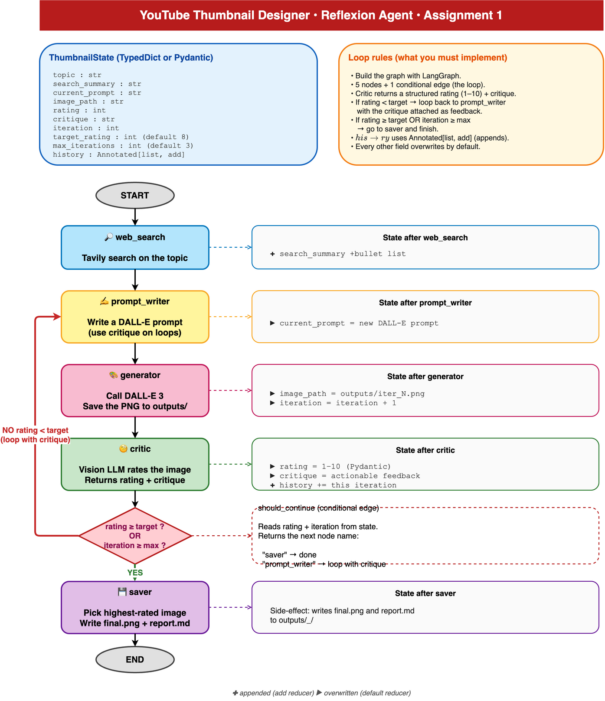

# Assignment 1: YouTube Thumbnail Designer (Reflexion Agent)

In this assignment you will build a **YouTube Thumbnail Designer** that
designs a thumbnail for a given video topic, then keeps improving it through
self-criticism until the thumbnail is good enough.

You **must build this agent using LangGraph**, following the architecture
diagram below.  No raw LangChain chains alone, no plain Python loops.
The iterative refinement must happen inside a compiled LangGraph state machine.

## What you are building

You hand the agent a video topic, like *"Why Python is the best language for AI"*.
The agent then:

1. Searches the web for hooks and visual references for that topic
2. Writes a detailed image-generation prompt
3. Calls DALL-E 3 (or any image model) to generate a thumbnail PNG
4. Sends the generated thumbnail to a vision LLM (e.g. GPT-4o) which
   returns a structured rating (1 to 10) and an actionable critique
5. If the rating is below the target (default 8), **loops back** to the
   prompt writer with the critique attached, so the next attempt fixes
   the problem
6. Stops when the rating crosses the target OR the iteration cap is hit,
   then saves the best thumbnail plus a report.md with the full history

The output is a folder containing the chosen thumbnail (`final.png`) and a
markdown report (`report.md`) showing every iteration: the prompt used,
the critic's score, and the critique.

## Architecture you must follow



The architecture diagram (also editable in `architecture.drawio`) shows
**5 nodes and 1 conditional edge**.  You must implement all of them in
LangGraph.

| Node | Purpose |
|---|---|
| `web_search` | One-time Tavily search.  Stores `search_summary` for the prompt writer to use. |
| `prompt_writer` | Writes (or re-writes) the DALL-E prompt.  On loop iterations it must incorporate the previous critique so the next image addresses every point. |
| `generator` | Calls DALL-E 3.  Saves the PNG.  Increments `iteration`. |
| `critic` | Vision LLM reads the generated PNG and returns a structured `rating` (int 1 to 10) and `critique` (string).  Append a row to `history`. |
| `saver` | Picks the highest-rated image from `history`, copies it as `final.png`, and writes `report.md` with all iterations. |
| `should_continue` (conditional edge) | Reads `state["rating"]` and `state["iteration"]`.  Returns the name of the next node (`"saver"` or `"prompt_writer"`). |

## Mandatory requirements

Your submission must satisfy ALL of the following:

1. **Built using LangGraph** (`from langgraph.graph import StateGraph, START, END`)
   with `graph.compile()` producing a runnable agent.
2. **At least 5 nodes** registered with `add_node`.
3. **At least 1 conditional edge** via `add_conditional_edges`.  This is
   the loop.  A plain `add_edge` is not enough.
4. **State schema** is a `TypedDict` (or Pydantic `BaseModel`) including
   the fields listed in the diagram.  `history` must use a reducer:
   `Annotated[list, operator.add]` (or equivalent) so iterations
   accumulate instead of overwriting.
5. **Structured output** from the critic.  Use Pydantic +
   `with_structured_output(...)` so `rating` is guaranteed to be an integer.
6. **Termination**.  The graph must stop when either:
   * `rating >= target_rating`  (default 8), OR
   * `iteration >= max_iterations`  (default 3)
7. **File outputs**.  Your `saver` node must produce:
   * `outputs/<timestamp>_<topic>/iter_N.png`  (every iteration)
   * `outputs/<timestamp>_<topic>/final.png`  (best one)
   * `outputs/<timestamp>_<topic>/report.md`  (markdown with all iterations)
8. **Graph visualization**.  Include a `make_diagram.py` that produces a
   PNG of your graph via `graph.get_graph().draw_mermaid_png()`.  Commit
   the rendered `graph.png` to the repo.
9. **No checkpointer required** for this assignment.  Keep `graph.compile()`
   plain.  Checkpointers come later.

## Suggested project structure

You are free to organise the code as you like, but a clean multi-file
layout is recommended (and easier to grade):

```
your_agent/
  __init__.py          load_dotenv() so submodules pick up API keys
  state.py             ThumbnailState TypedDict / Pydantic model
  prompts.py           system prompts for prompt_writer and critic
  tools.py             Tavily wrapper
  nodes.py             5 node functions + should_continue
  graph.py             build_graph() wires nodes + edges
  main.py              entry point: invoke or stream
  make_diagram.py      writes graph.png
  outputs/             (gitignored)  run reports + PNGs go here
```

## Setup

You need these accounts / keys:

| Service | What for | Cost |
|---|---|---|
| OpenAI | DALL-E 3 image generation + GPT-4o vision critic | ~$0.08 per image, ~$0.24 per full run |
| Tavily | Web search node | free tier is plenty |

Put them in `.env` (gitignored):

```
OPENAI_API_KEY=sk-...
TAVILY_API_KEY=tvly-...
```

Install dependencies:

```bash
uv sync                     # or: pip install -e .
```

Python 3.11+ required.

## Run it

Your `main.py` should support at least:

```bash
python -m your_agent.main "Why Python is the best language"
python -m your_agent.main "..." --stream      # show every node update live
```

And the diagram:

```bash
python -m your_agent.make_diagram             # writes graph.png
```

## Acceptance criteria (how this is graded)

| # | Criterion | Weight |
|---|---|---|
| 1 | Compiles and runs end-to-end on a fresh clone (`uv sync` then run) | 20% |
| 2 | Graph matches the architecture (5 nodes + conditional edge for the loop) | 20% |
| 3 | Loop actually fires.  At least one run shows iteration ≥ 2 in `report.md` | 15% |
| 4 | Critic uses structured output (Pydantic).  `rating` is a real int | 10% |
| 5 | `history` uses an append reducer.  Older iterations are preserved | 10% |
| 6 | Saver produces `final.png` + `report.md` showing every iteration | 10% |
| 7 | `make_diagram.py` produces a correct `graph.png` | 5% |
| 8 | Clean code organisation (separate files, no dumping everything in one) | 10% |

## Hints

* The same loop pattern appears in the reference `article_agent.py` in the
  class repo.  Open that file and look at how the conditional edge is wired
  and how `should_continue` reads state.  Adapt the pattern for thumbnails.
* For the vision critic, pass the image as a base64 data URL:
  ```python
  img_b64 = base64.b64encode(Path(image_path).read_bytes()).decode()
  HumanMessage(content=[
      {"type": "text", "text": "..."},
      {"type": "image_url", "image_url": {"url": f"data:image/png;base64,{img_b64}"}},
  ])
  ```
* For DALL-E 3 use `size="1792x1024"`.  That is roughly 16:9, the YouTube
  thumbnail aspect ratio.
* The prompt writer system prompt should explicitly forbid AI clichés
  (no "delve", no "in today's world") and require concrete visual
  elements (text overlay position, focal subject, lighting, mood).
* Be strict in the critic.  Most thumbnails are 5 to 7.  A 9+ should be
  exceptional.  This makes the loop actually iterate.

## What to submit

Push your solution to your own fork of this repository.  Make sure:

1. The code runs from a fresh `uv sync` plus `python -m your_agent.main "..."`.
2. `graph.png` is committed (re-generated by `make_diagram.py`).
3. At least one sample run is committed under `outputs/` showing the
   loop firing (so the grader can read `report.md` and see the
   iteration history).  You can temporarily un-gitignore one run for
   submission.
4. A short note at the bottom of this README listing anything you
   changed from the architecture and why.

Good luck.  Remember: the LOOP is the whole point.  If your first
draft already scores 9/10, your prompt writer is too good (or your
critic is too easy).  Tighten the critic so the loop actually runs.
